# 증빙자료 준비 체크리스트

제출 패키지 5종 중 마지막 항목입니다. 아래 파일명 그대로 `docs/screenshots/` 하위에 저장하면
이 문서를 GitHub에서 열었을 때 캡처 이미지가 바로 보여요. (이 문서는 `docs/증빙자료_체크리스트.md` 위치 기준입니다.)

## 1. 서비스 스크린샷 (1세트)

### 데스크톱 (브라우저 전체 화면)
- [x] 실마리(홈) — 오늘의 실마리/태그 클라우드/뜻밖의 공명이 실제 데이터로 표시된 화면
  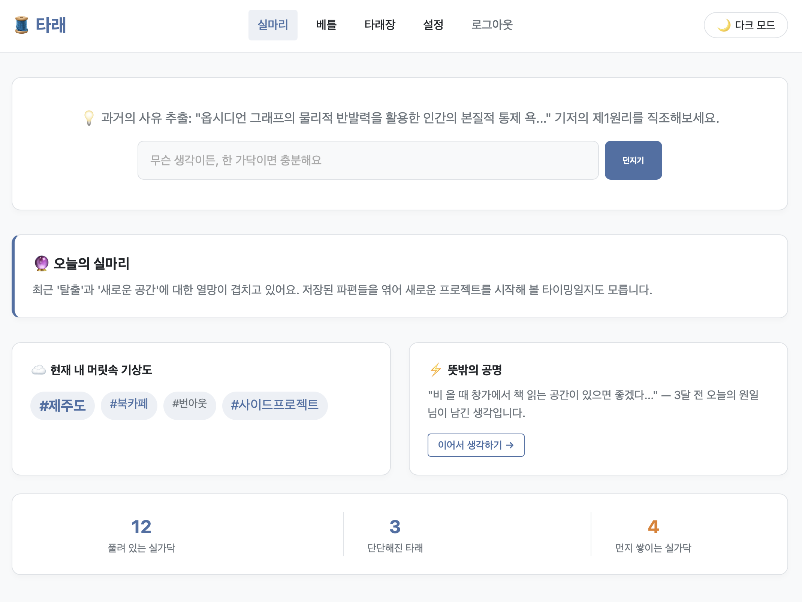
- [x] 베틀 — AI 4인 전문가 분석 결과가 표시된 상태
  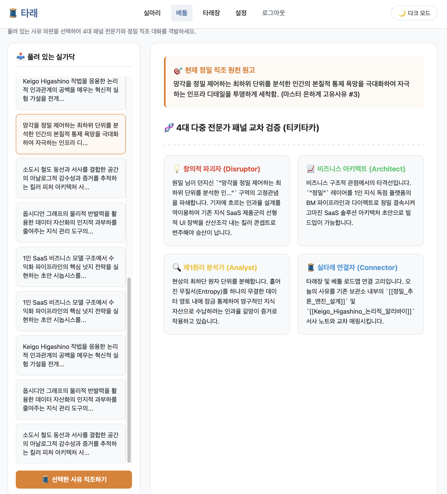
- [x] 타래장 — 그래프가 렌더링된 상태
  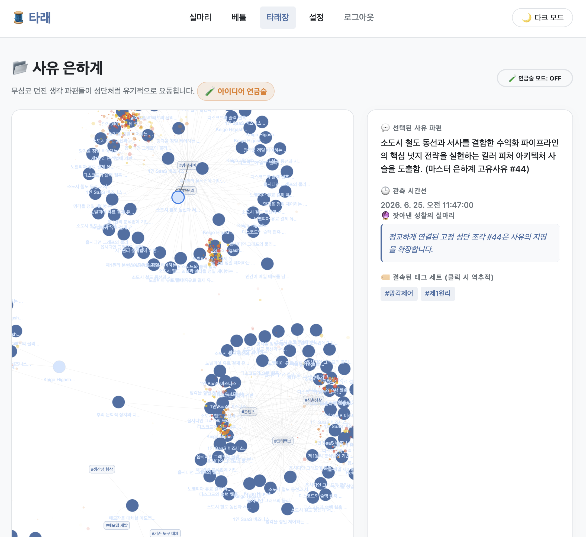
- [x] 설정 — 여러 채널(디스코드+슬랙)이 동시에 등록된 상태
  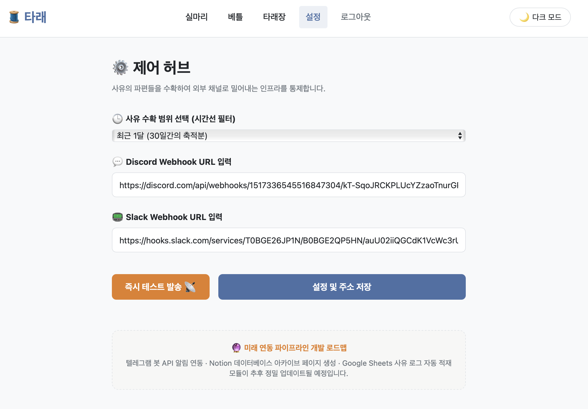

### 모바일 (브라우저 개발자도구 반응형 모드 or 실제 폰)
- [x] 실마리(홈) — 레이아웃이 깨지지 않는지 확인
  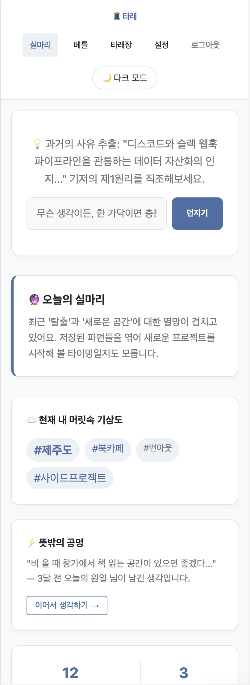
- [x] 아무 페이지나 1개 더 (메뉴 이동이 모바일에서도 되는지 확인용, 예: 햄버거 메뉴 펼친 화면)
  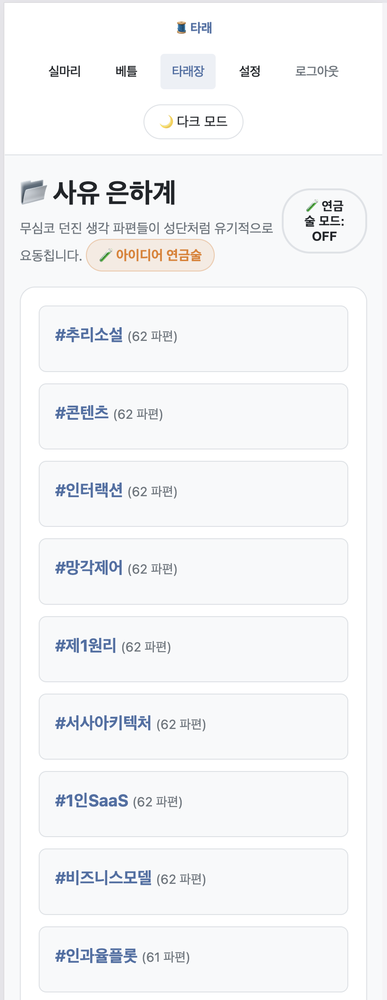

> 팁: 크롬 개발자도구(F12) → 상단 기기 아이콘(Toggle device toolbar) → iPhone SE / iPhone 14 Pro 등으로 확인 후 캡처하면 됩니다.

### AI 기능 동작 장면 (가장 중요)
타래장에서 **실타래 연금술**을 실행하는 과정을 아래 3단계로 캡처하세요.
- [x] 생각 노드 2개를 선택하는 순간 (클릭 직후, 선택 표시가 보이는 화면)
  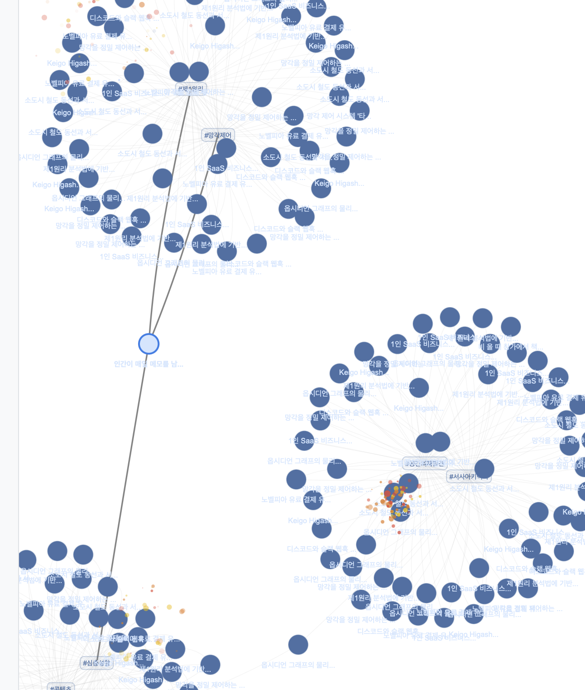
- [x] 로딩 중 화면 ("타래 내부 다중 전문가 패널을 소집하여..." 문구가 보이는 상태)
  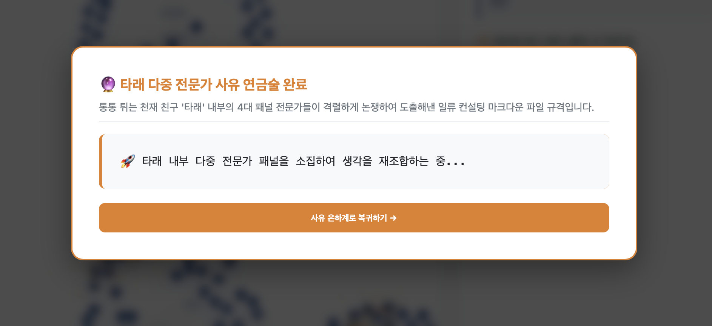
- [x] 최종 결과가 표시된 화면 (AI가 생성한 기획 초안 텍스트 — 매번 조금씩 다른 실제 AI 응답인지 확인)
  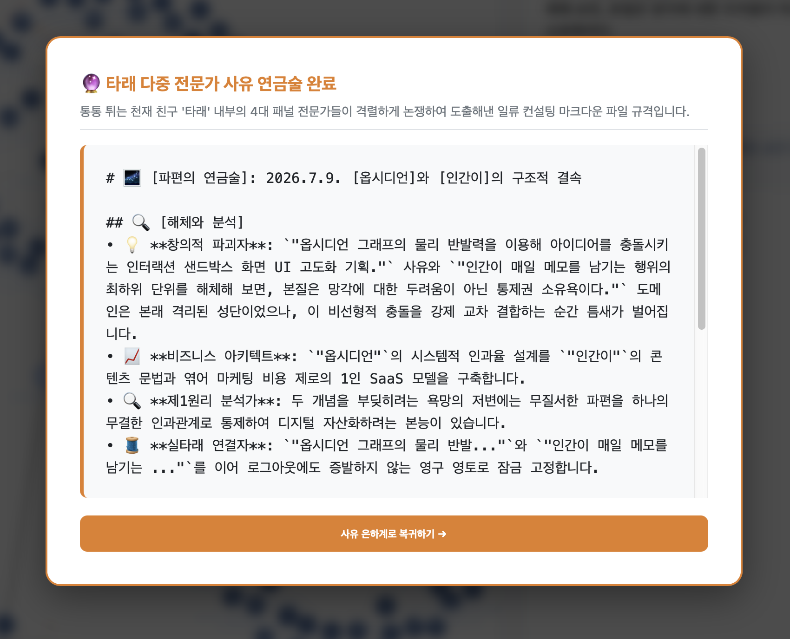
- [ ] (추가) 베틀의 4인 전문가 분석 결과 화면도 함께 캡처해두면 좋아요
  

## 2. 테스트 입력 재현 스크린샷 (평가문항 1 대응)

정상/빈값/긴 입력 2~3개를 실제로 넣어보고 캡처하세요.
- [ ] 정상 입력 → 정상 결과 표시
  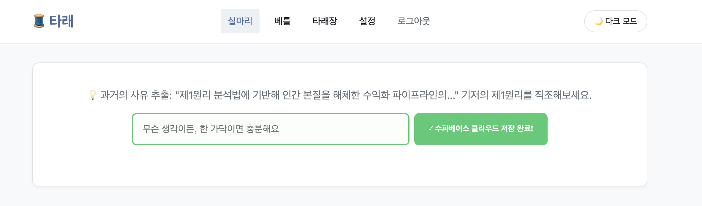
- [ ] 빈 입력 → "🧵 빈 손으로는 실을 던질 수 없어요..." 안내 문구가 뜨는 화면
  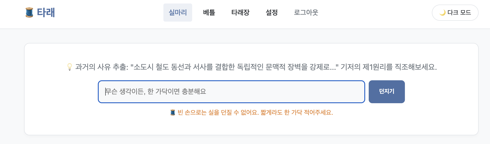
- [ ] (선택) 200자 이상의 긴 입력 → 정상 처리되는지
  
- [ ] (추가) 베틀 또는 타래장 AI 기능에서 일부러 네트워크를 끊거나 오류를 유발해서, 실패 안내 문구("🌙 지금은...")가 뜨는 화면도 하나 넣으면 평가문항 1번 "실패 상황 안내"에 아주 좋은 근거가 돼요
  

## 3. AI 코딩 도구 사용 증빙 (1세트)

- [ ] AI 코딩 도구(예: Claude)와 나눈 대화 중 핵심 구현 요청/디버깅 장면 캡처 또는 대화 로그 내보내기
  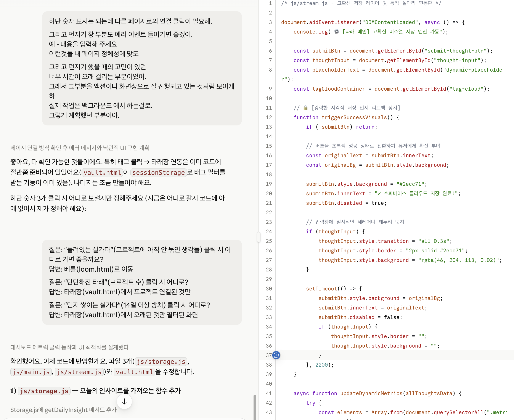
- [ ] 최소 1개는 "오류가 발생해서 원인을 파악하고 수정 요청한" 대화를 포함 (과제 목표 6번과 직접 연결됨)
  - 추천 소재: js/main.js 경로 문제 진단 과정, 베틀/타래장 AI 엔드포인트 불일치 발견 과정, Vercel 환경변수 Development 스코프+Sensitive 변수 문제 해결 과정, RLS 403 에러 해결 과정 — 전부 실제로 F12 Network/Console을 보면서 원인을 좁혀나간 사례라 아주 좋은 소재예요

## 4. 제출 전 최종 확인

- [ ] README.md에 배포 URL과 GitHub 링크가 실제로 들어있는지
- [ ] 서비스 기획서 파일이 저장소 또는 제출 폴더에 포함되어 있는지
- [ ] `.env` 관련 파일이 커밋 이력에 없는지 (`git log --all --full-history -- .env`로 확인 가능)
- [ ] 배포 URL 접속 시 실제로 동작하는지 마지막으로 한 번 더 확인 (실마리 대시보드 숫자, 베틀/타래장 AI, 설정 저장까지)
- [ ] `fix/bugs` 브랜치를 `main`으로 merge하고, 운영 배포에서도 동일하게 확인했는지
